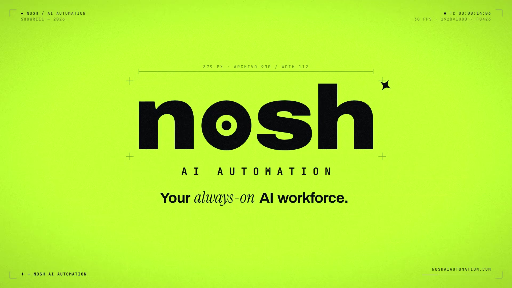
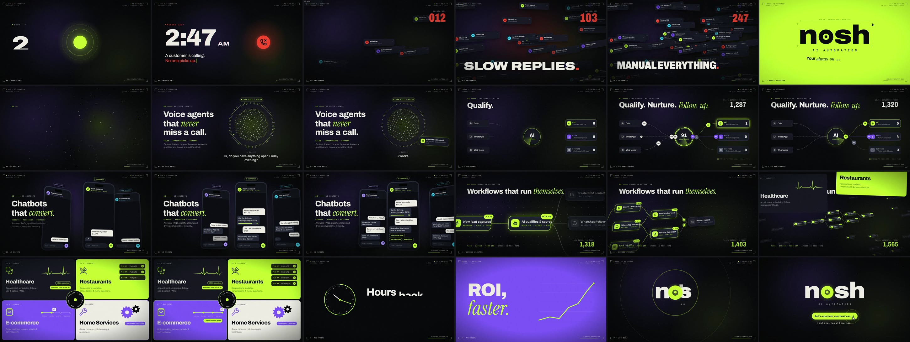
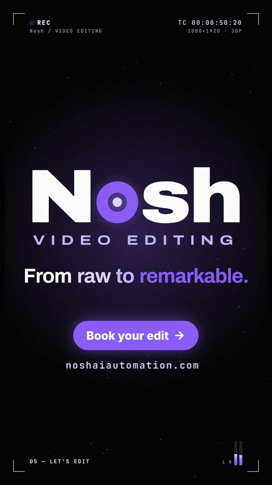
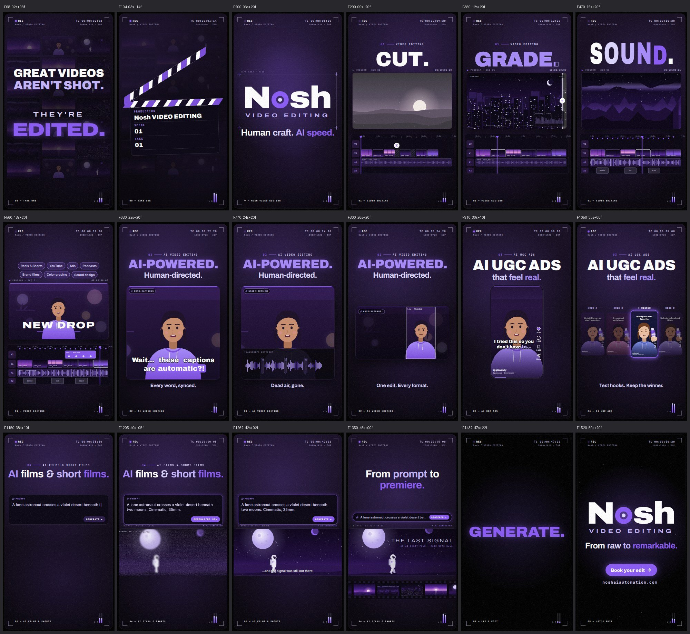

# Nosh — Motion Pieces

Two motion-graphics films for **[noshaiautomation.com](https://noshaiautomation.com)**, built entirely in code with [Remotion](https://www.remotion.dev) (React → video). Every frame is a pure function of time, so each piece is re-renderable, editable and re-brandable.

| Piece | Format | Watch |
|---|---|---|
| **Nosh AI Automation** — showreel | 1920×1080 · 16:9 · 60 s | [`renders/nosh-ai-automation-showreel.mp4`](renders/nosh-ai-automation-showreel.mp4) |
| **Nosh Video Editing** — vertical ad | 1080×1920 · 9:16 · 53 s | [`renders/nosh-video-editing-vertical.mp4`](renders/nosh-video-editing-vertical.mp4) |

Jump to: [Nosh AI Automation showreel](#1--nosh-ai-automation--60s-showreel) · [Nosh Video Editing vertical](#2--nosh-video-editing--53s-vertical-916) · [Project layout](#project-layout) · [Run it](#run-it) · [Credits](#credits)

---

## 1 · Nosh AI Automation — 60s Showreel

**Watch:** [`renders/nosh-ai-automation-showreel.mp4`](renders/nosh-ai-automation-showreel.mp4) — 1920×1080 · 30 fps · 60 s · H.264 (BT.709) + AAC 256k · 27 MB · −14 LUFS



<details><summary>Storyboard — one frame every 2.5 s</summary>



</details>

---

### Concept — "The dot that never sleeps"

A single lime dot is the always-on AI. It opens the reel, becomes a ringing call nobody answers, is the singularity the chaos collapses into, becomes the **o** of the wordmark, is dived through into the voice agent, and finally shrinks back to black — so the last frame loops into the first.

Everything is locked to a **120 BPM grid** (1 beat = 15 frames, 1 bar = 60 frames); cuts, hits and transitions land on beats.

| Time | Chapter | What happens | Signature technique |
|---|---|---|---|
| 0:00 | **2:47 AM** | Dot → ringing call → "No one picks up." → missed | Variable-font width animation, slot-roll digit, typewriter, RGB-split glitch, orb → card morph |
| 0:05 | **The problem** | Pull-back reveals 47 notifications flooding in; beat-synced kinetic words; everything implodes | Camera pull-back match cut, spring physics, 4 kinetic-type styles (mask / width-stretch / drop / decode), glitch slicing, radial speed lines |
| 0:12 | **The drop** | Lime detonation, wordmark slams in, dive through the "o" | Circle flood + shockwaves, per-letter slams with camera shake, stroke-drawn ring, scramble decode, exponential zoom-through |
| 0:16 | **01 Voice agents** | Particle voice orb listens and speaks; live captions; booking lands | Hand-projected 3D point cloud (720 pts) with simplex-noise displacement, radial spectrum, word-timed captions, confetti |
| 0:23 | **02 Lead qualification** | Leads travel from calls/WhatsApp/web into an AI scoring core and route to lanes | Whip pan with true directional motion blur, path draw-on, motion along bézier paths, score gauges, live counters |
| 0:30 | **03 Chatbots** | Three live conversations on three channels | Diagonal stripe wipe, CSS-3D phone rig orbit, bottom-anchored chat physics, typing indicators, chips |
| 0:37 | **04 Workflow automation** | Node graph executes; camera rides the packets, then reveals the scale | Zoom-through crossfade, tilted 3D infinite canvas, packets with trails, node activation glow, ghost workflows |
| 0:43 | **05 Built for your industry** | Healthcare · Restaurants · E-commerce · Home Services | 4-way panel slams, per-panel micro-animations (ECG, reservations, tracker, gears), circular type badge, staggered 3D card flip whose back faces assemble the next shot |
| 0:50 | **06 The outcome** | 24/7 · Hours back · Your IP · ROI, faster | Beat cuts with four different transitions (flip hand-off, push, iris, split doors), backwards clock, line-chart draw |
| 0:54 | **07 Let's build** | Words fly in from depth, collapse to the dot, dot unpacks into the lock-up; CTA clicked | 3D depth type, collapse to singularity, logo build from the dot, cursor + click ripple, loop-back to black |

A persistent **HUD** (timecode, frame counter, chapter labels, progress bar, crop marks), film grain and vignette tie it together as a reel.

Messaging is taken from Nosh's public positioning: AI voice agents (sales, appointments, support), the lead qualification system (calls, WhatsApp, CRM), AI chatbots (website, Messenger, WhatsApp), workflow automation (Make, Zapier, CRMs), and the four industries they serve. UI numbers inside the mock-ups (counters, scores, order numbers) are illustrative.

---

### Music & sound

**Music bed:** *"Take the Ride"* — **Bryan Teoh** (FreePD.com, 2020). Released into the public domain under **CC0 1.0** — free for commercial use, no attribution required (credited here anyway). Sourced from the [SoundSafari/CC0-1.0-Music](https://github.com/SoundSafari/CC0-1.0-Music) corpus. Original file: `audio/source/`.

The track was chosen by analysis, not guesswork (`scripts/analyze_music.py`): 120.999 BPM with 3.6 ms beat jitter, a genuine 14-second build, and a clean final hit. The edit (`audio/generate_soundtrack.py`):

- resampled by 121/120 so it runs at **exactly 120 BPM** (−14 cents, inaudible, no time-stretch artefacts) — its beats sit on the picture's 15-frame grid;
- the track's own drop (beat 32) is transient-aligned to the **logo drop at 0:12.000**, and its build fill lands on the chaos implosion;
- a low-pass filter sweep (650 Hz → open) builds through the hook and chaos, with a 5-frame silence before the drop;
- the finale collapses the bed and splices to the track's **real final hit (beat 512) at 0:56.000**; its natural tail rings under the lock-up.

**Sound design:** 164 cues synthesized from the same timeline as the picture (`src/lib/cues.ts` → `audio/cues.json`): phone ring, typing, notification pings, whooshes, whip, stripe swishes, impacts, UI pops, node chimes, click. All pitched sounds are tuned to the track's key (C# major pentatonic).

**Master:** −14 LUFS integrated, ≤ −1.2 dBFS peak (look-ahead limiter), 48 kHz.

**Delivery encode** (`scripts/deliver.sh`): the film grain is fresh noise every frame, so Remotion's CRF-16 master is ~93 Mbps. The delivery file is re-encoded with x264 CRF 27 / `tune=grain` (≈3.6 Mbps, visually indistinguishable at 100% crop), converted to limited-range BT.709, and its audio is re-muxed straight from the WAV — the master's AAC stream carries 42.7 ms of uncompensated encoder priming; the delivery file measures 0.00 ms offset against the source by cross-correlation.

---

## 2 · Nosh Video Editing — 53s Vertical (9:16)

**Watch:** [`renders/nosh-video-editing-vertical.mp4`](renders/nosh-video-editing-vertical.mp4) — 1080×1920 · 30 fps · 53 s · H.264 (BT.709) + AAC 256k



<details><summary>Storyboard — key frames</summary>



</details>

A vertical ad for **Nosh Video Editing**: video editing, AI video editing, AI UGC ads, AI films and AI short films. It is built for Reels, Shorts and TikTok. Titles and chapter labels stay inside the 9:16 safe area.

### Look — Nosh's own palette, dynamic type

- **Colours** were sampled from the noshaiautomation.com hero: a black page, a rounded purple-black card, and violet → lavender → lilac accents on white (`src/vertical/theme.ts`). Every frame sits inside that same rounded card.
- **Type is kinetic rather than a matched brand font.** Archivo's variable width (62–125) and weight (100–900) axes are animated per letter. Words are sized to the frame from real glyph advances (`archivoMetrics.json`), which lets every headline fill the width exactly. The kit has eight modes: `stretch`, `slam`, `decode`, `outline → fill`, `razor slice`, `bounce` (driven by the music), `fly` and `rise` (`src/vertical/components/DType.tsx`).
- **Wordmark:** "Nosh" is set with a capital **N**, and its **o** is a camera REC ring whose dot is the red-light of the whole piece (`NoshMark.tsx`).
- A **viewfinder HUD** frames the reel. It has a blinking REC light, timecode, format, scrambled chapter labels and L/R meters that read the actual soundtrack envelope.

### Structure

The piece runs on a **120 BPM grid** (1 beat = 15 frames). Chapter changes land on the music's impacts at 0:04, 0:20 and 0:36, and the lock-up lands on the track's final hit at 0:48.

| Time | Chapter | What happens | Signature technique |
|---|---|---|---|
| 0:00 | **Hook** | *"Great videos aren't shot. They're EDITED."* Flat log clips grade to colour on "EDITED.", a razor slices the word, and a clapperboard claps on the first impact | Log → graded wall, razor slice with blade streak, clapper physics |
| 0:04 | **Brand** | The Nosh wordmark slams in letter by letter, "VIDEO EDITING" decodes, then *"Human craft. AI speed."* | Per-letter slams + shockwaves, REC-ring "o", scramble decode, vertical whip with directional blur |
| 0:08 | **01 Video editing** | An NLE timeline cuts on the beat: **CUT.** (junk collapses, playhead), **GRADE.** (log/graded wipe + scopes), **SOUND.** (letters bounce to the real music), **MOTION.** (keyframed lower-third), then format chips | Razor cuts with ripple-delete, grade wipe, audio-reactive type, 9-blade aperture iris out |
| 0:20 | **02 AI video editing** | *"AI-POWERED. Human-directed."* Auto-captions in karaoke style, smart cuts that remove dead air, and auto-reframe from 16:9 to 9:16 with subject tracking | The card itself morphs shape, collapsing waveform gaps, and a glitch-slice exit |
| 0:28 | **03 AI UGC ads** | A creator-style ad plays in a social UI with captions and a product card. It shrinks into four hook variants and a winner is picked | Social-UI phone, variant grid, winner highlight, zoom exit |
| 0:36 | **04 AI films & short films** | A prompt is typed, then generated out of noise into a 2.39:1 cinematic shot. A subtitle, the title card *THE LAST SIGNAL* and a film strip follow. *"From prompt to premiere."* | Diffusion-style denoise (blur + noise → sharp), letterbox push-in, prompt card → prompt bar, film burn |
| 0:46 | **05 Finale** | **EDIT. ENHANCE. GENERATE.** on the beat, then everything collapses into the REC dot. The dot unpacks into the lock-up on the final hit: *"From raw to remarkable."* · **Book your edit →** · noshaiautomation.com. The REC light switches off to loop | Collapse to a singularity, logo built from the dot, CTA shimmer, typed URL, loop to black |

The footage inside the mock-ups (dunes, city, ocean, peaks, the astronaut, the creators) is drawn procedurally in SVG (`src/vertical/shots/`), so no stock media is used. UI numbers, handles and the product ("Glow Serum", @glowdaily) are illustrative.

### Music & sound

**Music bed:** *"Final Step"* by **Rafael Krux** (FreePD.com). It is public domain under **CC0 1.0** and comes from the same [SoundSafari/CC0-1.0-Music](https://github.com/SoundSafari/CC0-1.0-Music) corpus. The original file is in `audio/source/`.

- The track runs at 119.998 BPM, so it needs no retiming.
- Its impacts, which fall every 32 beats, are placed on the chapter changes. The edit aligns them to the beat grid rather than to detected onsets, because the booms have slow sub-bass attacks; grid alignment keeps them frame-accurate.
- A low-pass filter opens through the hook, with a short dip before the first impact.
- The bed is sucked out as the finale words collapse into the dot, and the track's real final hit is spliced onto the lock-up.

**Sound design:** 86 cues are synthesized from the vertical timeline (`src/vertical/cues.ts` → `audio/vertical-cues.json`). They include the razor, clapper, edit snips, the grade sweep, beat-marker blips, the aperture iris, shutter, dead-air zip, reframe beep, typing, the diffusion riser, sparkle, projector rattle and the logo drop. Pitched sounds are tuned to D minor pentatonic.

The generator also writes a per-frame loudness/low/high envelope (`src/vertical/audioEnvelope.json`). The picture reads it, so the HUD meters and the "SOUND." letters move with the real mix.

**Master:** −15.7 LUFS integrated, ≤ −1.2 dBFS peak (look-ahead limiter), 48 kHz. Delivery uses the same encode as the showreel: `bash scripts/deliver.sh vertical`, with audio re-muxed from the WAV.

---

## Project layout

```
src/
  Root.tsx, Showreel.tsx        composition + master timeline (Sequences, overlays, audio)
  lib/timeline.ts               single source of truth for all timings (120 BPM grid)
  lib/cues.ts                   sound-design cue sheet derived from timeline.ts
  lib/motion.ts, theme.ts       easing set, springs, helpers · colour + type tokens
  components/                   HUD/grain, kinetic type, wordmark, voice orb, phones, stripes, whip…
  scenes/S01…S10                one file per chapter
  vertical/                     Nosh Video Editing (9:16): theme, timeline, cues, dynamic-type kit,
                                viewfinder HUD, wordmark, transitions, procedural shots, scenes V1…V7
audio/generate_soundtrack.py    music edit + SFX synth + master → public/audio/soundtrack.wav
audio/generate_vertical_soundtrack.py   same for the vertical → public/audio/vertical-soundtrack.wav
scripts/                        cue export, contact-sheet review tool, music analysis, grain textures, delivery encode
renders/                        final videos, poster frames, storyboards
public/                         fonts (OFL), grain tiles, rendered soundtrack
```

## Run it

```bash
npm install
npm run dev                         # Remotion Studio (scrub the timeline)
npm run render                      # master → out/nosh-ai-automation-showreel.mp4 (~700 MB, CRF 16)
bash scripts/deliver.sh             # delivery → renders/nosh-ai-automation-showreel.mp4 (~27 MB)

# the vertical (Nosh Video Editing, 9:16)
npm run render:vertical             # master → out/nosh-video-editing-vertical.mp4
bash scripts/deliver.sh vertical    # delivery → renders/nosh-video-editing-vertical.mp4

# rebuild a soundtrack after changing timings
pip install numpy scipy soundfile pyloudnorm
node scripts/export-cues.mjs && python3 audio/generate_soundtrack.py
npm run audio:vertical              # export vertical cues + rebuild its soundtrack and envelope

# review: render labelled contact sheets of any frames
node scripts/stills.mjs mysheet 0-1799/60
node scripts/stills.mjs vsheet 0-1589/60 --comp=NoshVideoEditingVertical --scale=0.3
```

Set `REMOTION_BROWSER=/path/to/chrome-headless-shell` to use a preinstalled browser instead of downloading one.

## Re-branding

- **Colours / type:** `src/lib/theme.ts` (the lime accent, ink, violet, coral). Fonts are Archivo (variable, width + weight axes), Instrument Serif, JetBrains Mono and Inter — all SIL Open Font License.
- **Wordmark:** `src/components/Wordmark.tsx` sets "nosh" in Archivo 900 with a geometric ring-and-dot "o", positioned from measured glyph metrics. Swap in the official logo here if preferred.
- **Copy:** each scene's text lives at the top of its file in `src/scenes/`.
- **Vertical:** the palette is in `src/vertical/theme.ts`, the "Nosh" wordmark in `src/vertical/components/NoshMark.tsx`, and all timings in `src/vertical/timeline.ts`. After changing timings, run `npm run audio:vertical`.

## Credits

- Motion design, code & sound design: generated with Claude Code.
- Music: "Take the Ride" by Bryan Teoh (showreel) and "Final Step" by Rafael Krux (vertical). Both are from FreePD.com under CC0 1.0 (public domain).
- Fonts: Archivo (Omnibus-Type), Instrument Serif (Instrument), JetBrains Mono (JetBrains), Inter (Rasmus Andersson) — SIL OFL 1.1, via Fontsource.
- Icons: Lucide (ISC).
